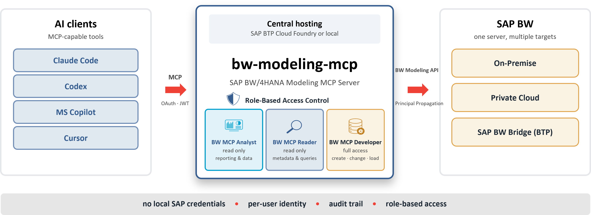

# bw-modeling-mcp

A Model Context Protocol (MCP) server that enables AI assistants like Claude to work directly inside SAP BW/4HANA systems — reading, creating and modifying BW modeling objects via the same internal SAP APIs that Eclipse BWMT and the BW/4HANA Cockpit use: the **BW Modeling REST API** (`/sap/bw/modeling/`) for objects, queries and live data, the **ADT API** (`/sap/bc/adt/`) for ABAP/AMDP routine source, the **BW/4HANA manage API** for the request monitor and runtime, and the **Push API** (`/sap/bw4/`) for data loads.

**This is not a simulation.** Every tool call connects to a live BW system — write operations produce real changes.

---

## ☁️ Running on SAP BTP Cloud Foundry



Besides stdio, the server can run as an HTTP service on SAP BTP Cloud Foundry with XSUAA
OAuth in front and a BTP destination behind — either a shared technical user
(`BasicAuthentication`) or **principal propagation**, where each caller reaches BW as
themselves and BW applies their own authorizations.

Two role collections decide what a user is offered: **BW MCP Reader** and **BW MCP Developer**.
stdio is unchanged — `npm start` behaves exactly as before. Setup:
[docs/CENTRAL-HOSTING-SETUP.md](docs/CENTRAL-HOSTING-SETUP.md) (step-by-step) and
[docs/CLOUD-FOUNDRY.md](docs/CLOUD-FOUNDRY.md) (reference).

### What central hosting changes

| Scenario | stdio only | Hosted on BTP |
|---|---|---|
| **One analyst, one BW system** | runs on the analyst's machine | server-side, the analyst logs in with their own identity |
| **Several analysts, one server** | not possible, no central auth | all log in via BTP, each caller's identity reaches BW |
| **Tool permissions** | none — whoever runs it can call every tool | granted per role, **independent of BW authorizations**: a BW developer can be read-only in the MCP, or the querying tools can be withheld from someone who may otherwise view data |
| **BW authorizations** | enforced through the user's own credentials | unchanged, still fully enforced — with principal propagation each caller acts as themselves, never as a shared identity |
| **Audit trail** | limited | XSUAA logs every login; with principal propagation the BW session log shows the real user |

A new tool stays unavailable to read-only callers until it is explicitly classified as a
read, so the surface never widens by accident; `write` implies `read`, never the reverse.
The two role collections are a starting point and can be split further in `xs-security.json`.
Principal propagation additionally needs a certificate rule and ICM trust on the BW side.

---

## 📖 Featured Blog Posts

A two-part blog series about this project (both available in German and English):

1. **Agentic AI meets SAP BW** — the full story behind this project: why I built it, what's inside, what happens when Claude walks through a complete BW data lineage on its own.
   https://www.nextlytics.com/blog/agentic-ai-meets-sap-bw

2. **Agentic AI in practice: MCP server for SAP BW/4HANA** — how the server is operated company-wide on SAP BTP Cloud Foundry with role-based access and per-user identity, plus two real customer projects.
   https://www.nextlytics.com/blog/agentic-ai-in-practice-mcp-server-for-sap-bw/4hana

---

## 🆕 What's New — v1.4.0

**🎯 SAP BW 7.5 on HANA**

Until now almost every call against a BW 7.5 system failed with HTTP 406, because the 7.5 REST framework looks the `Accept` header up case-sensitively. A small ABAP **post-exit** neutralises that — an enhancement, no modification. With it in place **every REST endpoint that exists on 7.5 is reachable**.

- **📘 [docs/BW75-SUPPORT.md](docs/BW75-SUPPORT.md)** — root cause, the ABAP code, the SE24 setup steps, and an honest list of what BW 7.5 ships no REST resource for at all
- **`bw_system_profile`** — tells you on connect what the system is, which endpoint groups it publishes, and whether the preconditions hold. Start here on an unknown system, or when calls fail with 404 or 406
- **`bw_read_metadata_tables`** — reads straight from the metadata tables where there is no REST resource: transformations (including routine source), DTPs, and the classic providers `ODSO`, `CUBE` and `MPRO`

**🔗 Process chains, edited in place**

- **`bw_add_process_chain_edge`**, **`bw_remove_process_chain_edge`**, **`bw_remove_process_chain_step`** — change one dependency or one step instead of rewriting the whole model. Removing a step takes its edges and its inline variant with it and bridges the gap, so the strand stays connected
- Steps are addressed by name — a DTP, an aDSO, the program of an ABAP step, a collector type, or `#<index>`. An ambiguous name is rejected with the candidates listed rather than resolved by guesswork
- `before` / `after` now inserts a DTP or ABAP block **in series**: the target's edges are rerouted through the block, so it really runs ahead of or behind that step

**🧱 Remodeling monitor**

- **`bw_list_remodeling_requests`**, **`bw_get_remodeling_request`**, **`bw_run_remodeling`** — monitor, diagnose and run remodeling requests: the five processing steps with their status and the application log per step, plus execute, restart, reset and reset-step. Running a rule restructures the InfoProvider and converts its data, so this is a write with data impact

**📐 Query characteristic properties**

- **`bw_update_query_characteristic`** — display of result rows, display as key/text, access type for result values, sorting, cumulation, display level, and the hierarchy assignment with its display options. `"*"` applies one set of properties to every characteristic in the layout

**🔧 Minor changes and fixes**

- DTP filters take the full range vocabulary — sign `I`/`E` with `Equal`, `Between`, `ContainsPattern` and the comparison operators — validated against the operators the field itself publishes
- The CSRF token fetch is retried once on a dead keep-alive socket, which used to abort a run of process-chain writes mid-sequence
- Process-chain run timestamps are parsed again ([#15](https://github.com/dnic-dev/bw-modeling-mcp/issues/15))
- `bw_get_request` works for requests without a process log ([#16](https://github.com/dnic-dev/bw-modeling-mcp/issues/16))
- A failed transformation model serialization is reported as such instead of dumped ([#17](https://github.com/dnic-dev/bw-modeling-mcp/issues/17))
- `NODESNOTCONNECTED` is no longer reported as an InfoArea ([#18](https://github.com/dnic-dev/bw-modeling-mcp/issues/18))
- Namespaced object names such as `/NAMESPACE/OBJECT_NAME` are addressed correctly in every URL ([#19](https://github.com/dnic-dev/bw-modeling-mcp/issues/19))

---

**Earlier releases** — the "What's New" notes for v1.3.0 and older are archived in [WHATS_NEW.md](WHATS_NEW.md); the full structured history is in [CHANGELOG.md](CHANGELOG.md).

---

## What it can do

### Search & Discovery
- Search BW objects by name or description (wildcards supported), filtered by type
- Where-used / dependency analysis (xref) for any BW object

### aDSO
- Read aDSO structure (fields, settings, version state)
- Create a new aDSO — from an aDSO template, from a DataSource (RSDS) template, or empty
- Add InfoObject-backed fields or pure (field-based) fields
- Remove fields
- Manage key fields
- Update field properties (aggregation, data type, length, etc.)
- Place fields in a field group — on creation, so a key figure lands in the key figure group without a second activation, or afterwards to move an existing field between groups
- Update aDSO settings (type preset, flags, description)
- Write-interface aDSO support (`pushMode`)

### InfoObject
- Read InfoObject definition
- Create Characteristic — all data types (CHAR, NUMC, DATS, TIMS, SNUMC), with or without master data and texts, with referenced InfoObject, with compounding parents
- Create Key Figure — all types (NUM, AMT, QTY, DAT, INT), all aggregations (SUM, MAX, MIN)
- Add and remove display and navigation attributes

### InfoArea
- Read InfoArea definition (name, label, parent area, status)
- Create a new InfoArea (immediately active, no activation step needed)
- Move any BW object to a different InfoArea

### InfoSource
- Read InfoSource structure (fields, key fields, label, InfoArea)
- Create InfoSource with full field definitions

### Transformation
- Read Transformation structure (all sources, all targets)
- Create a Transformation — including InfoObject (IOBJ) sources/targets with an explicit sub-type (text table, attributes/master data, hierarchy)
- Map source fields to target InfoObjects or plain fields (StepDirect)
- Set formula rules (StepFormula)
- Set field routines — ABAP and AMDP (StepRoutine)
- Set start routines — ABAP and AMDP
- Set end routines — ABAP and AMDP
- Set END routine target fields (explicit field list or exclusion list)
- Switch runtime between ABAP and AMDP

### DTP (Data Transfer Process)
- Read DTP structure and settings
- Create DTPs — including DataSource (RSDS) sources and InfoObject targets by sub-type (attributes, texts, hierarchies)
- Run (execute) a DTP load — returns the run request id for monitoring
- Update DTP settings and description
- Switch extraction mode between Full and Delta
- Set value filters on fields
- Set routine filters (ABAP code)

### BW Query
- Read a BW Query — metadata, variables, filter, layout, measures, exceptions, and settings
- Variables: type, processing type (UserEntry, Authorization, CustomerExit), input behavior
- Filter: fixed values and variable references fully resolved, including mixed selections
- Layout: rows, columns, free characteristics with full member lists and nested members
- Calculated key figures: recursively resolved human-readable formulas
- Restricted key figures: selection conditions (key figure + characteristic restrictions)
- Inline local measures inside structures: both formulas and selections
- Exceptions with alert levels and thresholds, cell definitions for grid layout queries
- Active version with automatic fallback to inactive
- Create a new, consistent Query (ELEM) on an InfoProvider — empty, or as a full copy of an existing query (layout, filter, variables, key figures) via `copy_from`
- Update the layout — rows, columns, structures, and free characteristics
- Update the filter — fixed values and restrictions
- Update key figures — basic key figures, references to global RKFs/CKFs, and local formula members with exception aggregation and display properties
- Build local formula members from the full BW analytic-engine operator catalog — arithmetic, percentage, data, mathematical, trigonometric, and boolean operators plus ternary `IF`; operand counts are validated before saving
- Update query settings (properties)
- Update the display and access properties of each characteristic in the layout — display of result rows, display as key/text, access type for result values, sorting, cumulation, display level, and the hierarchy assignment with its display options; in bulk across every characteristic with `"*"`
- Record query edits on a transport request for queries on a transportable package
- Delete a query
- Create characteristic variables — user entry, customer exit, authorization or replacement path; as characteristic value, hierarchy or hierarchy nodes; interval, single value, several single values or comparison operators

### Live Data Querying
- Execute a BEx Query or preview data from any InfoProvider (aDSO, CompositeProvider) — returns a formatted result table
- Fill query variables, control axis layout (rows / columns / free), apply characteristic filters with include/exclude and range operators
- Drill into hierarchy nodes and structure members (expand / collapse by tuple index)
- Look up valid characteristic values before setting filters or variables — returns both internal and external key formats

### CompositeProvider
- Read CompositeProvider structure — view node type (Union/Join), source providers (inputs) with mapping count, all fields with dimension classification, join conditions, and temporal join details
- Create a CompositeProvider — Union or Join node with its source providers attached, or as a copy of an existing one
- Attach and detach source providers, with their target elements created as needed
- Replace the field mappings of an input, either explicitly or mapped one to one from the source
- Set and remove join conditions per input pair, with join type and cardinality
- Add and remove fields, edit root settings (description, stackable, default node, aggregation behaviour)

### Global CP Components
- Read global Calculated Key Figure (CKF) — formula recursively resolved to a human-readable string, full dependency graph of all referenced sub-components
- Read global Restricted Key Figure (RKF) — base measure, all characteristic restriction groups with field and value details
- Read global Structure — all members with Formula/Selection breakdown, referenced components, characteristic filters, optional child members
- Create a reusable Restricted Key Figure (RKF) on an InfoProvider — from a base key figure plus characteristic restrictions (built for mass creation, one per call); each value is validated against the InfoProvider and written consistent, no separate activation

### Repository Navigation
- Navigate the full BW repository tree — drill from InfoArea to type folder to object to sub-folder, mirroring the Eclipse BWMT Project Explorer; each entry returns a `children_path` for seamless drill-down

### Data Flow Navigation
- Traverse the complete structural data flow graph of any BW object — all connected sources and targets resolved recursively through Transformations, DTPs, InfoSources, aDSOs, DataSources, CompositeProviders, and InfoObjects; mirrors the Eclipse BWMT Transient Data Flow view

### DataSource Navigation & Authoring
- List all source systems connected to the BW system (ODP_SAP, ODP_CDS, ODP_BW, ODP, FILE, HANA_SDA, HANA_LOCAL)
- Recursively list all DataSources in a source system with full APCO hierarchy path
- Read full source system metadata including connection details (ODP context/destination, HANA remote source and schema)
- Read complete DataSource structure: fields with types, lengths, transfer flags, adapter configuration
- Discover remote entities (HANA views / virtual tables) exposed by a source system
- Create a DataSource from a remote entity using the server's field proposal (inactive; activate separately)
- Change the delta process of a DataSource (`deltaProperties`)
- Set the transfer flag of DataSource fields and/or the segment language field

### BW Role Management
- Read the full role hierarchy (ROLE + FOLDER structure)
- List all queries published per role
- Check which roles a specific query is assigned to
- Publish a query into a role or a specific sub-folder
- Remove a query from a role or folder
- Move a query between roles (remove from old, add to new)

### Push API
- Get JSON push schema for a write-interface aDSO
- Push JSON record arrays directly into an aDSO

### Process Chain Navigation, Authoring & Monitoring
- Read complete Process Chain definitions — all steps with type, variant, description, and last execution status
- Conditional flow semantics fully resolved: DECISION branch labels (including ABAP formula expressions), OR/AND join nodes, positive/negative/neutral edge conditions
- Automatic variant detail per step: ABAP program and selection variant, TRIGGER scheduling parameters, ADSOACT/ADSOREM aDSO targets and cleanup settings, PLSWITCHL/P target aDSO, DECISION branching formulas — all embedded inline in a single tool call
- Recursive sub-chain expansion: CHAIN-type steps reference other Process Chains — call `bw_get_process_chain` again on any referenced chain name to expand the full hierarchy
- Generic process variant reader: covers all 93 BW/4HANA process types including custom Z-types; unknown types return oDetail as raw JSON
- Create a Process Chain from a step and edge list — supported types: `DTP_LOAD`, `ADSOACT`, `ADSOREM` (DSO request cleanup), `ABAP` (execute an ABAP program, optionally with an SE38 selection variant), `CHAIN`, `DECISION`, collectors `AND` / `OR` / `XOR`
- Replace the step model of an existing chain; activate a chain
- Incrementally edit an existing chain — insert a DTP load step (optionally with its own DSO activation) or an "Execute ABAP Program" step **in series** before or after any existing step, swap one DTP load variant for another, add on-error (negative) links mirroring the existing success links
- Repair the wiring of an existing chain — add or remove a single dependency between two steps, or remove a step altogether with the gap bridged automatically
- Create a DECISION process variant for use as a branch/decision step
- Monitor execution runs: history with status and timestamps, step-level and message-level run detail, last status per chain across the entire system

### DataSource Data Preview
- Fetch a live data preview from any DataSource (RSDS) directly from the source system
- Field names resolved automatically from the DataSource structure; configurable record count (default 20)
- Rendered as a padded plain-text table with column alignment

### Open Hub Destination
- Read an Open Hub Destination (DEST): destination type, source object, DB table, InfoArea, package, and status
- Complete output field list with types, InfoObject binding, conversion routine, compounding, and key flag
- File properties for FILE-type destinations

### Integrated Planning
- Create and change Aggregation Levels on an aDSO or a CompositeProvider — over all fields of the provider or a chosen subset
- Read Aggregation Levels (ALVL) — the planning-enabled view on top of an InfoProvider; characteristics and key figures with full type and semantic detail
- Read Planning Functions (PLSE) — function type, characteristic usage roles, and parameter tree; FOX code surfaced for FORMULA functions
- Read Planning Sequences (PLSQ) — ordered step list with aggregation level, planning function, and filter references
- Read Planning Properties (PLCR) — key-date mode, maximum characteristic combinations, and save strategy for plan-enabled InfoProviders

### Request Monitor & Runtime
- List load requests for a target InfoProvider — status, last process status/action, record count, timestamp, user, TSN
- Full status analysis of a single load request — header, DTP information (start/finish/duration), process step chain, and message log in one call
- Activate loaded data (DSO request activation) — move a finished load from the inbound table into the active data table + change log
- Uses the BW/4HANA `/sap/bc/.../bw4` manage API (the same operations as the BW/4HANA Cockpit)

### General
- Search & Where-Used (xref)
- Activate BW objects (aDSO, InfoObject, Transformation, DTP, DataSource, CompositeProvider)
- Release locks without activating (discard changes)
- Delete BW objects
- Transport request assignment — add a user task (sub-request) to a workbench transport, list changeable transport requests and their tasks
- Reassign an object to a different package (Development Class) on a transport request

---

## Combining with an ADT MCP Server

For tasks involving ABAP or SQLScript (AMDP) logic inside Transformations, **bw-modeling-mcp works best alongside an ADT MCP server** such as [vibing-steampunk](https://github.com/oisee/vibing-steampunk) or [ARC-1](https://github.com/arc-mcp/arc-1).

The BW MCP server handles the BW modeling structure — creating the Transformation, setting up routines, activating objects. The ADT MCP server handles reading and writing the actual ABAP class source code that backs the routine. Together, they cover the full development cycle from BW object creation to ABAP logic implementation.

---

## System Compatibility

| System | Support |
|---|---|
| SAP BW/4HANA (all versions) | ✅ Full support |
| SAP BW Bridge (SAP BTP ABAP stack) | ✅ Via cookie authentication (`BW_COOKIE_FILE`) |
| SAP BW on HANA (7.5) | ⚠️ Modeling reads after a small ABAP enhancement — see [BW 7.5 Support](docs/BW75-SUPPORT.md) |

<p><em><sub>On SAP BW 7.5 the REST framework looks up the <code>Accept</code> header case-sensitively while the kernel delivers header names in lower case, so almost every call fails with HTTP 406. A ~20-line post-exit enhancement (no modification) resolves this and makes all REST endpoints that exist on 7.5 reachable. Objects for which BW 7.5 ships no REST resource at all — transformations, DTPs, process chains, classic DSOs, InfoCubes — remain unavailable; Eclipse opens the embedded SAP GUI for those as well. Details, ABAP code and setup steps: <a href="docs/BW75-SUPPORT.md">docs/BW75-SUPPORT.md</a>.</sub></em></p>

---

## Requirements

- SAP BW/4HANA system with the internal SAP APIs enabled (SAP BW 7.5 works for modeling reads once the enhancement in [docs/BW75-SUPPORT.md](docs/BW75-SUPPORT.md) is in place)
- Node.js 18 or later
- An MCP-compatible AI client (Claude Desktop, Claude Code, etc.)

---

## Installation

> **Two ways to run.** Locally as a **stdio** server (one user, one machine — the steps below), or **centrally hosted** on SAP BTP Cloud Foundry behind XSUAA OAuth for a whole team → see [docs/CENTRAL-HOSTING-SETUP.md](docs/CENTRAL-HOSTING-SETUP.md). The installation and configuration below cover local stdio use; upgrading an existing local setup is non-breaking.

```bash
# Option 1: Install via npm (recommended)
npm install -g bw-modeling-mcp

# Option 2: Clone and build
git clone https://github.com/dnic-dev/bw-modeling-mcp.git
cd bw-modeling-mcp
npm install
npm run build
```

---

## Configuration

For **local (stdio)** use, the server is configured via environment variables. For **central BTP hosting**, connection and credentials come from the BTP destination and service bindings instead — see [docs/CENTRAL-HOSTING-SETUP.md](docs/CENTRAL-HOSTING-SETUP.md).

| Variable | Description | Required |
|---|---|---|
| `BW_URL` | BW system URL (e.g. `https://myhost:50001`) | yes |
| `BW_USER` | SAP user name | yes (or `BW_COOKIE_FILE`) |
| `BW_PASSWORD` | SAP password | yes (or `BW_COOKIE_FILE`) |
| `BW_CLIENT` | SAP client (e.g. `001`) | yes |
| `BW_LANGUAGE` | Language for object texts (e.g. `EN`, `DE`). Default: `DE` | no |
| `BW_COOKIE_FILE` | Path to a browser-exported cookie file for SAML-/OAuth-fronted systems (e.g. BW Bridge). Netscape or `name=value` format. When set, `BW_USER` / `BW_PASSWORD` are optional. | no |

**Cookie authentication (BW Bridge / SAP BTP):** For BW systems that sit behind a SAML or OAuth login (such as BW Bridge on the SAP BTP ABAP stack), Basic Auth is not available. Export the authenticated session cookies from your browser into a file and point `BW_COOKIE_FILE` at it. The login/session approach is analogous to [vibing-steampunk](https://github.com/oisee/vibing-steampunk) and [ARC-1](https://github.com/arc-mcp/arc-1). When the session expires, refresh the cookie file and restart the server.

### Claude Desktop

Add to `claude_desktop_config.json`:

```json
{
  "mcpServers": {
    "bw-modeling-mcp": {
      "command": "node",
      "args": ["/path/to/bw-modeling-mcp/dist/stdio.js"],
      "env": {
        "BW_URL": "https://your-bw-host:50001",
        "BW_USER": "YOUR_USER",
        "BW_PASSWORD": "YOUR_PASSWORD",
        "BW_CLIENT": "001",
        "BW_LANGUAGE": "EN"
      }
    }
  }
}
```

### Claude Code (VS Code extension)

Add `.mcp.json` to your project root:

```json
{
  "mcpServers": {
    "bw-modeling-mcp": {
      "command": "node",
      "args": ["/path/to/bw-modeling-mcp/dist/stdio.js"],
      "env": {
        "BW_URL": "https://your-bw-host:50001",
        "BW_USER": "YOUR_USER",
        "BW_PASSWORD": "YOUR_PASSWORD",
        "BW_CLIENT": "001",
        "BW_LANGUAGE": "EN"
      }
    }
  }
}
```

---

## Tools Reference

### `bw_search`
Search BW objects by name or description. Supports wildcards (`*`). Optionally filter by object type (`ADSO`, `IOBJ`, `TRFN`, `DTPA`, etc.).

### `bw_xref`
Find all objects that reference a given BW object (where-used analysis). Use this to find Transformations and DTPs connected to an aDSO, or to find the process chain(s) a DTP belongs to (`object_type=DTPA`).

For DataSources (`object_type=RSDS`): pass `source_system` — the correctly space-padded objectName is built automatically.

### `bw_system_profile` _(Read only)_
Report what the connected BW system is and which tool groups work on it. Distinguishes SAP BW/4HANA from classic SAP BW via the system's own `b4hanamode` flag, lists which REST endpoint groups the system publishes, and verifies three preconditions: whether `Accept`-header handling works (a broken one makes almost every call fail with HTTP 406 on BW 7.5 — see [docs/BW75-SUPPORT.md](docs/BW75-SUPPORT.md)), whether the ADT DataPreview service is reachable for this user, and whether the BICS reporting resource is implemented — classic BW publishes the query endpoint but does not implement reporting, so query definitions are readable there while `bw_query_data` and `bw_get_filter_values` are not. Call this first when connecting to an unknown system, or when tools fail with 404 or 406.

### `bw_read_metadata_tables` _(Read only)_
Read an object definition directly from its metadata tables, via the ADT DataPreview service. Read-only fallback for the object types a system publishes no REST resource for — on classic SAP BW typically transformations and DTPs, and on every release the classic providers. Supported `object_type`: `TRFN` (including start, end, expert and field routine source code), `DTPA`, `ODSO`, `CUBE` and `MPRO`. InfoCubes and DataStore objects additionally report their **load history**: request, status, update mode, start time, user, duration, records transferred and added, and the source. On classic BW that is the only way to see load status at all, since the manage API behind `bw_list_requests` does not exist there. Requires ADT authorization for the calling user; prefer `bw_get_transformation` where the REST endpoint exists.

### `bw_get_adso`
Read the full structure of an aDSO — fields, key fields, settings, version state.

### `bw_create_adso`
Create a new aDSO. Supports two modes: `from_template` (copies structure from an existing aDSO) or `empty`. Supports all aDSO type presets including write-interface (`pushMode`).

### `bw_update_adso`
Modify an existing aDSO. Actions:
- `add_field` — add an InfoObject-backed field
- `add_pure_field` — add a field-based (pure) field without an InfoObject
- `remove_field` — remove a field
- `manage_keys` — set or update key fields
- `update_field_properties` — change aggregation, data type, length, etc.
- `update_settings` — change aDSO type preset, flags, or description


Field groups: `dimension` takes the bare group name — `"__KEYFIGURES"`, `"DATA"`, whatever the aDSO declares — on `add_field` and `add_pure_field` to create the field in that group directly, and under `properties` on `update_field_properties` to move an existing one. Group names are defined per aDSO; an unknown name is rejected with the declared groups listed. The current assignment is the `DIM` column of `bw_get_adso`.
### `bw_get_infoobject`
Read an InfoObject definition (Characteristic or Key Figure).

### `bw_create_infoobject`
Create a new InfoObject. Supports:
- **Characteristic (CHA):** all data types (CHAR, NUMC, DATS, TIMS, SNUMC), with or without master data and texts, with compound parent InfoObjects, with referenced InfoObject
- **Key Figure (KYF):** all types (NUM, AMT, QTY, DAT, INT), all aggregations (SUM, MAX, MIN)

Created as inactive — activate with `bw_activate`.

### `bw_update_infoobject`
Add or remove display (`DIS`) and navigation (`NAV`) attributes on an existing Characteristic.

### `bw_get_infoarea`
Read an InfoArea definition — name, label, parent area, object status.

### `bw_create_infoarea`
Create a new InfoArea. Immediately active after creation, no activation step needed.

### `bw_move_object`
Move any BW object (aDSO, InfoObject, InfoArea, etc.) to a different InfoArea.

### `bw_change_package`
Reassign an existing BW object to a different package (Development Class) and record the change on a transport request via the CTO write endpoint. A single write, no activation — afterwards the object is inactive and must be re-activated with `bw_activate` (passing the same transport). For DataSources (`object_type="RSDS"`) `source_system` is mandatory (compound key) and the applied package is verified by re-reading the DataSource. Verified for `TRFN` and `RSDS`; other TLOGO types use the same mechanism but are not trace-verified.

### `bw_create_transport_task`
Add a task (sub-request) for a user to an existing workbench transport request.

### `bw_list_changeable_transports`
List transport requests and their tasks via the BW transport state (`cto/check`).

### `bw_get_infosource`
Read an InfoSource (TRCS) structure — fields, key fields, label, InfoArea, version status.

### `bw_create_infosource`
Create a new InfoSource with full field definitions.

### `bw_update_infosource`
Update an existing InfoSource — fields and description.

### `bw_get_transformation`
Read a Transformation structure including all field mapping rules, routines, source, and target. Transformation names are UUID-like keys — use `bw_xref` on the target aDSO to find them.

### `bw_create_transformation`
Create a new Transformation. Supports all source types (aDSO, InfoSource, DataSource/RSDS) and all target types (aDSO). For InfoObject (`IOBJ`) sources or targets, set `source_object_subtype` / `target_object_subtype` to select the facet — `TEXT` (text table), `ATTR` (attributes / master data), or `HIER` (hierarchy). Can copy structure from an existing Transformation.

### `bw_update_transformation`
Modify field mappings in an existing Transformation:
- Map source field to target InfoObject (StepDirect)
- Set formula rule for a target field (StepFormula)

### `bw_set_transformation_routine`
Set a field routine, start routine, or end routine on a Transformation. Supports both ABAP and AMDP (SQLScript). The routine code is written in combination with an ADT MCP server.

### `bw_set_transformation_expert_routine`
Write the code of an existing Start/End/Expert routine into the Transformation master so it survives activation and transport. Unlike a raw `WriteSource` on the generated class, this re-saves the master and keeps the routine code transport-stable.

### `bw_delete_transformation_routine`
Remove an existing routine from a Transformation field.

### `bw_set_transformation_runtime`
Switch the Transformation runtime between ABAP and HANA (AMDP). The current runtime is read from the active version, the change is activated automatically, and the result is verified against the active version — no separate `bw_activate` call is needed. If the switch does not persist (e.g. the server refuses HANA runtime for this transformation), the tool returns an error instead of a false-positive success.

### `bw_get_dtp`
Read the full definition of a single DTP — source, target, transformation reference, extraction settings (mode, package size), and all filter fields including value selections and routine code. DTP names are UUID-like keys — use `bw_xref` or `bw_get_dtps` to find them.

### `bw_get_dtps`
List all DTPs that depend on a given BW object or Transformation.

### `bw_create_dtp`
Create a new DTP on a Transformation. Source and target are derived from the Transformation automatically. For a DataSource source, set `source_type="RSDS"` and pass `source_system`. For an InfoObject target (`target_type="IOBJ"`), select the loaded sub-object with `target_object_subtype` — `ATTR` (attributes / master data, default), `TEXT` (texts), or `HIER` (hierarchies).

### `bw_run_dtp`
Start (execute) a run of an existing, active DTP. Returns the new run request id (an RSPM TSN) that can be passed directly to `bw_get_request` for monitoring.

### `bw_update_dtp`
Update a DTP — description, value filters on fields, and extraction mode (`extraction_mode` = `full` / `delta`). Note: switching between Delta and Full has BW delta-init implications — a later delta load may require re-initialization.

### `bw_set_dtp_filter_routine`
Set an ABAP routine filter on a DTP field. The generated routine's inactive version is syntax-checked before activation — broken code is reported with the ABAP messages and the DTP is left unchanged, instead of being falsely reported as activated.

### `bw_get_push_schema`
Get the expected JSON schema for pushing data into a write-interface aDSO.

### `bw_push_data`
Push a JSON record array directly into a write-interface aDSO via the BW Push API (`/sap/bw4/v1/push/`).

### `bw_get_query` _(Read only)_
Read a BW Query definition — variables, filter logic (fixed values and variable references resolved), layout with full member lists, calculated key figures with recursively resolved formulas, restricted key figures with selection conditions, exceptions, and query settings. Output format: `text` (default, compact human-readable summary) or `raw` (full parsed JSON).

### `bw_query_data` _(Read only)_
Execute a BEx Query or preview data from an InfoProvider (aDSO, CompositeProvider) via the BICS reporting endpoint. Returns a formatted result table with hierarchy indentation.

Parameters: `comp_id` (query or provider name), `is_provider` (set `true` for direct aDSO/HCPR access), `state` (axis placement — ROWS/COLUMNS/FREE — and per-characteristic filters supporting EQ/BT/GT/LT/GE/LE, include/exclude, external key, internal GUID key, and hierarchy-node filters), `variables` (fill query variables; name and id must be copied verbatim from the GET response), `from_row`/`to_row` (pagination), `drill_operations` (expand or collapse hierarchy and structure nodes by 1-based tuple index: `drill_state=3` expands, `drill_state=2` collapses), `format` (`text` default — formatted table; `raw` — XML).

Always call `bw_get_query` or `bw_get_adso` first to discover the axis layout and characteristic IDs, and call `bw_get_filter_values` before setting any filter or variable value.

### `bw_get_filter_values` _(Read only)_
Look up valid values for a characteristic — required before setting any filter or variable. Returns `CHAVL_EXT` (use for state filters) and `CHAVL_INT` (use for variable inputs); formats differ for date-type characteristics. Supports wildcard search (`*` for all values, prefix match e.g. `2022*`). Optionally scope results to a specific InfoProvider.

### `bw_create_query`
Create a new, consistent Query (TLOGO ELEM) on an InfoProvider in package `$TMP`. Without `copy_from` the query is created empty and consistent (no rows, columns, or key figures yet). With `copy_from` it is created as a full copy of an existing query (layout, filter, variables, key figures); when no `infoprovider` is given it defaults to the source query's provider.

### `bw_update_query_layout`
Edit the query layout — add/remove rows, columns, structures, and free characteristics. Accepts an optional `transport` request number for queries on a transportable package.

### `bw_update_query_filter`
Edit the query filter — fixed value restrictions on characteristics. Accepts an optional `transport` request number.

### `bw_update_query_key_figures`
Edit the query key figures — add basic key figures, references to global RKFs/CKFs, and local formula members; set exception aggregation and display properties (decimals, hidden, sign inversion); remove members. Formula members accept a recursive operator/operand tree covering the full BW operator catalog (basic, percentage, data, mathematical, trigonometric, and boolean operators plus ternary `IF`); operator codes are case-insensitive and their operand counts are validated before saving. Accepts an optional `transport` request number.

### `bw_update_query_settings`
Edit query properties (settings). Accepts an optional `transport` request number.

### `bw_update_query_characteristic`
Set the per-characteristic display and access properties of the rows, columns, and free-characteristics areas — display of result rows, display as key/text (with short/medium/long text), access type for result values (read mode), sorting, cumulation, display level, and the hierarchy assignment with its display options (expand-to-level, child node position, postable node values, single-child suppression, hierarchy sorting). Pass `"*"` as `infoobject` to apply one set of properties to every characteristic in the layout; every property also accepts `"default"` to drop the explicit value. Accepts an optional `transport` request number.

### `bw_get_process_chain` _(Read only)_
Read a Process Chain (RSPC) definition — header metadata, scheduling and monitoring settings, all steps with type, variant, last execution status, conditional dependencies with DECISION branch labels, and automatically embedded variant configuration per step. Set `include_variant_details=false` for a fast structural overview. Output format: `text` (default) or `raw` (full JSON).

### `bw_get_process_variant` _(Read only)_
Read the detail configuration of a single Process Chain step variant. Generic across all process types — oDetail rendered as indented JSON. Use process_type and variant_name from `bw_get_process_chain` output.

### `bw_create_process_chain`
Create a Process Chain (RSPC) from a step and edge list — builds the model, creates a trigger-only skeleton, then updates it with the full model in one operation; optionally activates. Supported step types: `DTP_LOAD`, `ADSOACT`, `ADSOREM` (DSO request cleanup), `ABAP` (execute an ABAP program, optionally with an SE38 selection variant), `CHAIN` (local sub-chain start), `DECISION`, collectors `AND` / `OR` / `XOR`.

### `bw_update_process_chain`
Replace the step model (nodes and edges) of an existing Process Chain, preserving the existing trigger node and scheduling. Optionally overrides description and InfoArea. Replaces the whole step model, so every step that should survive must be listed — for a small change to a large chain prefer the in-place tools below.

### `bw_activate_process_chain`
Activate an existing Process Chain. Returns the top-level activation message, severity, and full log.

### `bw_append_process_chain_dtp`
Add one DTP load step (optionally followed by its own DSO activation step) to an existing Process Chain. `before` / `after` place the whole block **in series** relative to an existing step — the target's incoming (or outgoing) edges are rerouted through the block, so the new steps really run ahead of (or behind) it. Without them the block is only appended behind the strand end and runs in parallel to the target's existing successors.

### `bw_swap_process_chain_dtp`
Swap one DTP load variant for another in an existing Process Chain, keeping the surrounding edges intact.

### `bw_add_process_chain_error_links`
Add on-error (negative) links to an existing Process Chain by mirroring the existing success links.

### `bw_create_decision_variant`
Create a DECISION process variant (a standalone TLOGO object) for use as a branch/decision step in a Process Chain.

### `bw_add_process_chain_program`
Add an "Execute ABAP Program" step (RSPC process type ABAP) to an existing Process Chain, optionally with a named SE38 selection variant. In-place edit — the program call is stored as an inline process variant inside the chain model (no separate variant object). Positioning via `before` / `after` / `predecessor` (default: strand end closest to the trigger); idempotent (a matching ABAP step is skipped), with ETag concurrency and transport handling.

### `bw_add_process_chain_edge`
Add one dependency between two existing steps of a Process Chain. Edge condition defaults to neutral out of the trigger or a collector, positive elsewhere; `sub_status` addresses a DECISION branch. An "always continue" dependency is two edges (positive plus negative), so call it twice. Idempotent — an identical edge is skipped without writing.

### `bw_remove_process_chain_edge`
Remove the dependency between two existing steps. By default both halves of an "always continue" link go; `status` narrows the removal to one of them.

### `bw_remove_process_chain_step`
Remove one step from a Process Chain together with its edges and its inline process variant. By default the gap is bridged — every predecessor takes over every successor, keeping the condition of the edge that ran into the removed step — so the strand stays connected. The trigger cannot be removed.

Steps are addressed by name in all three tools: a DTP or process-variant name, an aDSO held by an `ADSOACT`/`ADSOREM` step, the program of an `ABAP` step (or `PROGRAM/VARIANT`), a collector type, or `#<index>` using the step numbers from `bw_get_process_chain`. An ambiguous name is rejected with the candidates listed rather than resolved by guesswork.

### `bw_preview_datasource` _(Read only)_
Fetch a live data preview from a DataSource. Resolves field names automatically and renders a formatted table. Parameters: `datasource_name`, `source_system`, `records` (default 20).

### `bw_get_roles` _(Read only)_
Read the complete BW role hierarchy as displayed in the Eclipse BWMT "Publish to Role" dialog. Returns all ROLE and FOLDER nodes with technical names, descriptions, and nodeids. Optional `role_filter` parameter limits output to roles whose name starts with the given prefix (e.g. `"BW:"`).

### `bw_get_role_queries` _(Read only)_
List all BW Queries published in the role hierarchy, grouped by role and folder. Only `SAP_BW_QUERY` objects are returned — PFCG menu entries of other types (e.g. AFO workbooks added as transactions) are not included. Optional `role_name` to scope to a specific role.

### `bw_get_query_roles` _(Read only)_
Return all roles and folders where a specific BW Query is currently published. Returns a clear "not published" message if the query has no role assignments.

### `bw_set_query_roles`
Publish or remove a BW Query from a role or folder. Parameters: `query_name`, `action` (`"add"` or `"remove"`), `target_type` (`"role"` or `"folder"`), `target_name` (role name attribute for role-level, folder txt for folder-level), `parent_role_name` (required when `target_type="folder"`). For add operations, the full role subtree is fetched automatically from `bw_get_roles` — no manual lookup needed.

### `bw_get_composite_provider` _(Read only)_
Read a CompositeProvider (HCPR) — view node type (Union/Join), source providers with input mapping counts, all fields with dimension classification, join conditions, and temporal join details.

### `bw_create_composite_provider`
Create a CompositeProvider. Without `copy_from`, a view node of the given type with the listed source providers attached — entity only, so give them their mappings afterwards with `bw_update_composite_provider` action `update_mapping`. A Union node may be created empty; a Join node must be created with its sources, since a join node without inputs makes the server dump. With `copy_from`, the server copies view node, inputs and mappings from an existing CompositeProvider. The result is inactive.

### `bw_update_composite_provider`
Change a CompositeProvider. Eight actions: `add_field` / `remove_field` for fields, `add_input` / `remove_input` for source providers, `update_mapping` for one input's complete mapping list (omit the mappings to map every source field one to one), `update_join` / `remove_join` per input pair, and `update_settings` for description, stackable, default node and aggregation behaviour. Every action returns a `lock_handle` that `bw_activate` needs — an HCPR cannot be activated without it.

Two things to know: both sides of a join key must be mapped onto the **same** target field, otherwise activation fails with "join fields need at least one common target field" — auto-mapping deliberately does not do this, so map the second side's key fields explicitly. And `remove_input` leaves the removed input's elements and any join referencing it behind; those have to be cleaned up separately.

### `bw_create_aggregation_level`
Create an aggregation level (ALVL) on a planning-enabled aDSO or CompositeProvider, either over all its fields or a chosen subset. Needs at least one characteristic and one key figure. Activate with `bw_activate`, object type `alvl` and an empty `lock_handle`.

### `bw_update_aggregation_level`
Change the field selection of an existing aggregation level.

### `bw_create_variable`
Create a characteristic variable. Processing type: `UserEntry`, `CustomerExit`, `Authorization` or `ReplacementPath`. Represents a characteristic value, a hierarchy or hierarchy nodes; selection as `Interval`, `SingleValue`, `SeveralSingleValues` or `SelectionOption`. Entry requirement, ready-for-input and reusability are parameters, so a variable filled only by the exit can be kept off the selection screen. Replacement path is limited to the current-member variant — replacement from a query result is not supported.

### `bw_get_ckf` _(Read only)_
Read a global Calculated Key Figure — formula recursively resolved to a human-readable string, metadata (package, InfoArea, author), and full dependency graph of all referenced sub-components.

### `bw_get_rkf` _(Read only)_
Read a global Restricted Key Figure — base measure, all characteristic restriction groups (field and value), and metadata.

### `bw_get_structure` _(Read only)_
Read a global Structure — all members with type (Formula/Selection), referenced components, characteristic filters, optional child members, and metadata.

### `bw_create_rkf`
Create one reusable Restricted Key Figure (TLOGO ELEM) on an InfoProvider from a base key figure plus one or more characteristic restrictions. Built for mass creation (one RKF per call); each restriction value is validated against the InfoProvider and mapped to its internal key before the write, and the RKF is written consistent (no separate activation step). Supports `Equal` / `Between` / `LessThan` / `GreaterThan` / `LessEqual` / `GreaterEqual` / `Contains` operators and exclusions, an optional InfoArea, and a transport request for transportable packages.

### `bw_list_contents` _(Read only)_
Navigate the BW repository tree. Pass a path such as `""` (all InfoAreas), `"area/MYAREA"` (InfoArea contents), `"hcpr/CP_NAME"` (CP sub-folders), or `"adso/ADSO_NAME/trfn"` (Transformations on an aDSO). Each entry includes `children_path` to drill down further.

### `bw_list_source_systems` _(Read only)_
List all logical source systems (LSYS) registered in the BW DataSource structure. Optionally filter by type (`ODP_BW`, `ODP_SAP`, `ODP_CDS`, `ODP`, `FILE`). Each entry includes `children_path` — pass it directly to `bw_list_datasources` as `source_system`.

### `bw_list_datasources` _(Read only)_
List all DataSources available under a logical source system. Recursively traverses the full APCO hierarchy. Each DataSource entry includes name, description, status, and the full `apco_path` (ordered list of application component titles from root to the DataSource). Output format: `text` (default table) or `raw` (XML feed bodies).

### `bw_get_source_system` _(Read only)_
Read the metadata of a single logical source system — type, description, and connection details. For ODP systems: context, destination, validity flags. For HANA systems: remote source, database, schema, SDI adapter.

### `bw_get_datasource` _(Read only)_
Read the complete structure of a DataSource (RSDS): metadata (status, delta type, direct access, application component, package, timestamps), all fields with type, length, transfer flag, key flag, position, selection options, conversion exit, and unit/currency reference, plus active adapter configuration (ODP, HANA, File, CSV). Output format: `text` (default human-readable summary) or `raw` (XML from BW).

### `bw_change_datasource_delta`
Change the delta process of a DataSource (`deltaProperties`). Full read-modify-write; leaves the object inactive for a separate `bw_activate`.

### `bw_set_datasource_fields`
Set the transfer flag of one or more DataSource fields (`fieldProperties@transfer`) and/or the segment `language_field`. At least one of `fields` / `language_field` must be given.

### `bw_get_dataflow` _(Read only)_
Read the complete structural data flow of a BW object — all connected sources and targets resolved recursively through Transformations, DTPs, InfoSources, aDSOs, DataSources, CompositeProviders, and InfoObjects. Mirrors the Eclipse BWMT Transient Data Flow view. Supports direction (`upwards` / `downwards` / `both`) and configurable depth. Note: routine-based lookups (ABAP/SQLScript) are not reflected — only structural BW dependencies.

### `bw_list_requests` _(Read only)_
List load requests for a target InfoProvider via the BW/4HANA manage API — status, last process status and last action, record count, timestamp, user, and TSN. The TSN feeds `bw_get_request`.

### `bw_get_request` _(Read only)_
Full status analysis of one load request in a single call — request header, DTP information (start/finish/duration), process step chain, and message log. Output format: `text` (default) or `raw` (parsed JSON of all four payloads).

### `bw_list_remodeling_requests` _(Read only)_
List remodeling requests from the remodeling monitor — InfoProvider, rule, decoded status, last run, and creator. Remodeling restructures an existing InfoProvider (adding, deleting or reassigning a field) and converts the data it already holds. Filter by `info_provider` and by status (`N` not scheduled, `S` scheduled, `R` running, `C` completed, `E` error).

### `bw_get_remodeling_request` _(Read only)_
Full status of one remodeling request — header, the five processing steps (`CHECK`, `SAVE`, `CONVERT`, `ACTIVATE`, `CLEANUP`) with their individual status, and the application log messages grouped per step. The request is addressed by `info_provider` plus `remodeling_rule`; the internal request GUID is resolved automatically. This is the tool to diagnose a failed remodeling.

### `bw_run_remodeling`
Start, restart or reset a remodeling request — `action` = `execute` \ `restart` \ `reset` \ `reset_step`. `start` accepts `immediate` (default) or an ISO 8601 timestamp to schedule the background job. Runs asynchronously; monitor completion with `bw_get_remodeling_request`. Note: executing a rule restructures the InfoProvider and converts its existing data — this is not a plain reload and cannot simply be undone. Remodeling rules themselves are created in the BW Modeling Tools; this tool family monitors and runs the resulting requests.

### `bw_activate_request`
Activate loaded data (DSO request activation) — move a finished load from the inbound table into the active data table and change log. This is the runtime request activation (BW/4HANA manage API), distinct from the modeling-object activation done by `bw_activate`; it applies only to aDSOs that have an activation step and runs asynchronously.

### `bw_activate`
Activate one or more BW objects. Handles impact analysis and automatically deactivated DTPs. Supports: `adso`, `iobj`, `trfn`, `dtp`, `rsds` (DataSource).

### `bw_unlock`
Release a lock on a BW object without activating (discard changes).

### `bw_delete`
Delete a BW object. Works for aDSO, InfoObject, InfoArea, and other types.

---

## How it works

The server connects to the SAP BW Modeling REST API (`/sap/bw/modeling/`) — the same internal API used by Eclipse BWMT. All write operations follow the BW locking protocol:

1. **Lock** — acquires an exclusive lock and returns a `lockHandle`
2. **Read** — fetches the current complete XML of the object
3. **Modify** — applies changes to the XML
4. **PUT** — sends the full modified XML back (never partial updates)
5. **Activate** — promotes the inactive version to active
6. **Unlock** — releases the lock

Session cookies and CSRF tokens are managed automatically.

See [ARCHITECTURE.md](ARCHITECTURE.md) for the full technical architecture and complete API reference.

---

## Roadmap

- **Tool consolidation** — collapse today's one-tool-per-operation surface into a small set of verb-based tools (`bw_read`, `bw_find`, `bw_write_*`, …) that cover the same operations. Same functionality, a single consistent `name` parameter across all reads, and each new operation then costs one enum value instead of a whole new tool — so coverage keeps growing while the surface stays within MCP clients' tool limits.
- **More modeling & Cockpit coverage** — integrate and complete further BW modeling and BW/4HANA Cockpit operations, e.g. Open ODS Views, further planning objects, additional runtime and monitoring operations, and further modeling objects.

---

## Contributing

Issues and feature requests are welcome — please use the [Issue templates](https://github.com/dnic-dev/bw-modeling-mcp/issues/new/choose).

If you have access to a BW/4HANA system and want to help expand coverage, I am happy to hear from you. The best way to contribute is to try it out and report what works, what doesn't, and what's missing.

---

## License

MIT
