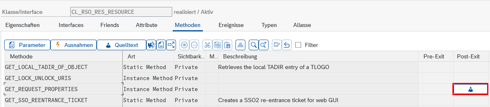
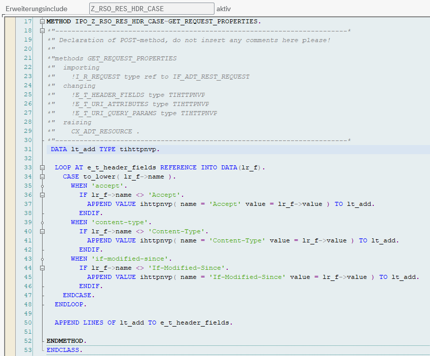

# SAP BW 7.5 on HANA — Support

Out of the box, almost every tool fails against a BW 7.5 system with **HTTP 406**. The cause is a
single case-sensitive line in the 7.5 REST framework, and it can be neutralised with one small ABAP
enhancement — no modification of SAP standard.

With that enhancement in place, **every REST endpoint that exists on 7.5 becomes reachable**. What
remains out of reach are the objects for which SAP never shipped a REST resource on 7.5 at all
(see [What is still unavailable](#what-is-still-unavailable)).

Verified end-to-end on a BW 7.5 system (SAP_BASIS 750).

---

## The symptom

Nearly every read returns:

```
HTTP 406 — ExceptionResourceNotAcceptable
Backend supports vnd.sap.bw.modeling.adso-v1_2_0,
but requested is vnd.sap.bw.modeling.adso-v1_0_0
```

Two details in that message identify the defect:

- The requested version is **v1_0_0** — this is not what the client sent. It is the hardcoded
  fallback `P_C_FALLBACK_VERSION` from `CL_RSO_RES_CNT_TYPE_HANDLER=>CLASS_CONSTRUCTOR`. The
  `Accept` value the client sent never appears, because it was never read.
- The message number is `RSO_RES_FRMW 013`, not `014`. The difference depends on
  `l_with_cnt_type_header`, so `013` means the secondary lookup on `Content-Type` also came up
  empty. Both lookups failed.

A few tools appear to work — those whose backend resource happens to sit at v1_0_0, where the
fallback accidentally matches. This is what creates the misleading impression that the server is
"partly compatible".

---

## Root cause

1. The ICF/kernel hands the HTTP header table to ABAP with **lower-case field names**. In
   `CL_HTTP_ENTITY` both `IF_HTTP_ENTITY~GET_HEADER_FIELDS` and `~GET_HEADER_FIELD` are pure kernel
   calls (`system-call ict`) — there is no ABAP statement that changes the casing, and none that
   could be patched.

2. The BW REST framework uses the **table variant** and looks the header up by exact key:

   ```abap
   READ TABLE i_t_headerfields WITH TABLE KEY name = c_accept_key   " 'Accept'
   IF sy-subrc <> 0.
     READ TABLE i_t_headerfields WITH TABLE KEY name = c_content_type_key  " 'Content-Type'
   ```

   `WITH TABLE KEY` compares the key fields exactly — `accept` never matches `'Accept'`.

   The single-value API `get_header_field( )` resolves case-insensitively inside the kernel. Had the
   framework used it, the defect would not exist.

3. With no header found, `IS_REQUEST_COMPATIBLE` synthesises a default content type **without a
   version part**. `PARSE_CONTENT_TYPE` then applies the fallback version 1.0.0.

4. `IS_COMPATIBLE` compares the backend resource version against that assumed 1.0.0. Anything above
   it yields `incomp_version_too_high`, which `CL_RSO_RES_CNT_HDL_FACTORY=>GET_INSTANCE` turns into
   `CX_ADT_RES_NOT_ACCEPTABLE` → **HTTP 406**.

### Why BW/4HANA is not affected

Newer releases carry two additional constants in `CL_RSO_RES_CNT_TYPE_HANDLER` —
`C_ACCEPT_KEY_HTTP` (`'accept'`) and `C_CONTENT_TYPE_KEY_HTTP` (`'content-type'`) — evaluated by
`CL_RSO_RES_CNT_HDL_FACTORY=>GET_ACCEPT_HEADER` as a four-step cascade:
`Accept` → `accept` → `Content-Type` → `content-type`.

That correction was never back-ported to 7.5. On 7.5 the class has only the two upper-case
constants, and `GET_ACCEPT_HEADER` does not exist at all.

### Why Eclipse BWMT is not affected

BWMT communicates over **RFC/JCo**, not HTTP. `CL_REST_RFC_UTILITIES=>CREATE_REST_REQUEST` builds a
pure ABAP request object (`CL_REST_REQUEST`) from the RFC payload, so the ICF HTTP parser is never
involved and the original casing survives. The same applies to any other JCo-based ADT client.

### A second symptom of the same defect

`IF_RSO_RES_CONSTANTS=>CN_IF_MODIFIED_SINCE` is spelled `'If-Modified-Since'` and is read the same
way in `GET_INSTANCE`. Over HTTP that lookup silently fails too, so the conditional-GET branch never
triggers. Harmless, but it shows the HTTP path was never exercised against a non-JCo client.

---

## The fix

A **post-exit** on `CL_RSO_RES_RESOURCE=>GET_REQUEST_PROPERTIES`.

That method is the single place where every BW modeling request obtains its header table — it is
called from the DELETE, GET, POST and PUT handlers of the resource base class. `E_T_HEADER_FIELDS`
is an exporting parameter of that method and is exposed as a **changing** parameter inside the
post-exit, so it can be modified.

```abap
  DATA lt_add TYPE tihttpnvp.

  LOOP AT e_t_header_fields REFERENCE INTO DATA(lr_f).
    CASE to_lower( lr_f->name ).
      WHEN 'accept'.
        IF lr_f->name <> 'Accept'.
          APPEND VALUE ihttpnvp( name = 'Accept' value = lr_f->value ) TO lt_add.
        ENDIF.
      WHEN 'content-type'.
        IF lr_f->name <> 'Content-Type'.
          APPEND VALUE ihttpnvp( name = 'Content-Type' value = lr_f->value ) TO lt_add.
        ENDIF.
      WHEN 'if-modified-since'.
        IF lr_f->name <> 'If-Modified-Since'.
          APPEND VALUE ihttpnvp( name = 'If-Modified-Since' value = lr_f->value ) TO lt_add.
        ENDIF.
    ENDCASE.
  ENDLOOP.

  APPEND LINES OF lt_add TO e_t_header_fields.
```

Two deliberate design decisions:

- **Additive, never replacing.** Existing entries are untouched; only canonically spelled duplicates
  are added. `TIHTTPNVP` is a standard table with a non-unique key, so this cannot collide, and code
  expecting lower-case names keeps working.
- **Collected in `lt_add`** rather than appended inside the loop, so the iteration does not walk over
  its own insertions.

### Why this is uncritical

- **No-op wherever the header already arrives correctly** — in particular on the RFC path used by
  Eclipse BWMT, where the condition is never true. The cost there is one loop over a handful of
  header lines.
- **Enhancement, not modification** — no SSCR object key, no modification adjustment on upgrade.
- **Cannot raise an exception**: `LOOP`, `to_lower`, `APPEND` on a string table. No cast, no
  division, no unbound reference, no database access. This matters because a dump here would break
  every BW modeling request.
- **Removable at any time** via SE24/SE19.

Note the reach, though: the exit sits in the central request path, so it affects every BW modeling
client of that system. Roll it out the usual way — development, then a test system with BWMT in
active use, then production.

### Fallback variant

If the enhancement cannot be created on the private method, use a **pre-exit** on the public
`CL_RSO_RES_CNT_TYPE_HANDLER->IS_REQUEST_COMPATIBLE` instead — importing parameters are modifiable
in a pre-exit:

```abap
  READ TABLE i_t_headerfields WITH TABLE KEY name = 'Accept' TRANSPORTING NO FIELDS.
  IF sy-subrc <> 0.
    LOOP AT i_t_headerfields REFERENCE INTO DATA(lr_f).
      IF to_lower( lr_f->name ) = 'accept'.
        APPEND VALUE ihttpnvp( name = 'Accept' value = lr_f->value ) TO i_t_headerfields.
        EXIT.
      ENDIF.
    ENDLOOP.
  ENDIF.
```

This covers content negotiation only, not the `If-Modified-Since` branch.

---

## How to apply

Class enhancements with pre/post exits cannot be created from Eclipse ADT — use the SAP GUI.

1. Transaction **SE24**, open `CL_RSO_RES_RESOURCE`, press **Display**.
2. Menu **Class → Enhance** (`Ctrl+F4`).
3. Create an enhancement implementation, e.g. `Z_RSO_RES_HDR_CASE`.
4. Tab **Methods**, select `GET_REQUEST_PROPERTIES` (it sits in the private section).
5. Menu **Edit → Enhancement Operations → Create Post-Method** (also available from the context menu
   of the method row; the exact wording varies by release). If the entry is greyed out, use the
   fallback variant above.

   The method list then shows the post-exit marker in the rightmost column:

   

6. Double-click the generated `IPO_GET_REQUEST_PROPERTIES` and paste the body — SE24 generates
   `METHOD` / `ENDMETHOD` itself.
7. **Activate** (`Ctrl+F3`). The enhancement include then looks like this:

   

   Note the generated signature: the exporting parameters of the original method — including
   `E_T_HEADER_FIELDS` — are passed to the post-exit as **changing** parameters.

To roll back, delete the post-method in the same menu, or remove the enhancement implementation in
SE19. SAP standard is never touched.

---

## Verifying

Read any aDSO whose backend resource version is above v1_0_0 — for example with `bw_get_adso`.
Before the enhancement this returns HTTP 406; afterwards the full structure is returned.

To confirm at the source, set a breakpoint in
`CL_RSO_RES_CNT_TYPE_HANDLER=>IS_REQUEST_COMPATIBLE`: `i_t_headerfields` must now contain both an
`accept` and an `Accept` entry, and the first `READ TABLE` must hit `sy-subrc = 0`.

If a 406 still appears afterwards, read it carefully — it will now carry **real** version numbers on
both sides instead of the 1.0.0 fallback. That is a genuine media type negotiation issue, which the
client resolves through the discovery document at runtime.

---

## What works after the fix

Verified against a BW 7.5 system:

| Area | Status |
|---|---|
| aDSO — read | ✅ |
| InfoObject — read | ✅ |
| CompositeProvider incl. calculated/restricted key figures and structures | ✅ |
| Queries — read | ✅ |
| Repository navigation and object search | ✅ |
| Where-used / lineage (xref) | ✅ |
| InfoArea, InfoSource, DataSource, Open Hub | ✅ endpoints published by discovery |

The client reconciles resource versions automatically: the discovery document is read at startup and
overrides the hardcoded media type defaults, including downgrades (a 7.5 backend serving an older
resource version rejects a higher one with HTTP 415).

---

## What is still unavailable

These objects have **no REST resource on 7.5** — the limitation is the missing endpoint, not the
header:

| Area | Endpoint | Note |
|---|---|---|
| Transformations | `trfn` | not published by discovery |
| DTPs | `dtpa` | not published by discovery |
| Process chains | `rspc` | search by this object type dumps server-side |
| Planning functions and sequences | `plcr`, `plsq`, `plse` | only `alvl` is available |
| Transport operations | `cto/*` | not published by discovery |
| Data flow graph | `dmod` | the DataFlow workspace in discovery is empty |
| Requests, monitoring, process variants, push | `/sap/bw4/*` | the BW/4HANA manage API does not exist on 7.5 |
| Classic DSO, InfoCube, MultiProvider | `odso` and friends | see below |

This is systematic rather than accidental: the BW Modeling Tools for 7.5 never supported editing
transformations, DTPs or process chains — those capabilities arrived with BW/4HANA. Opening such an
object in Eclipse does not issue a REST call at all; it fetches a reentrance ticket and launches the
**embedded SAP GUI**.

The repository tree does publish a `self_url` for classic DSOs, but it is a dead link: every path and
`Accept` combination answers `404 — resource does not exist`. For transformations the router does
respond, but the object name is truncated to 28 characters in the URI attribute, so a 32-character
transformation ID can never be addressed.

